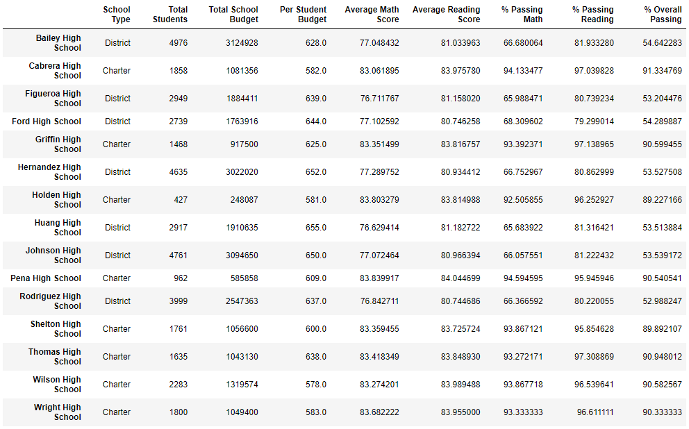
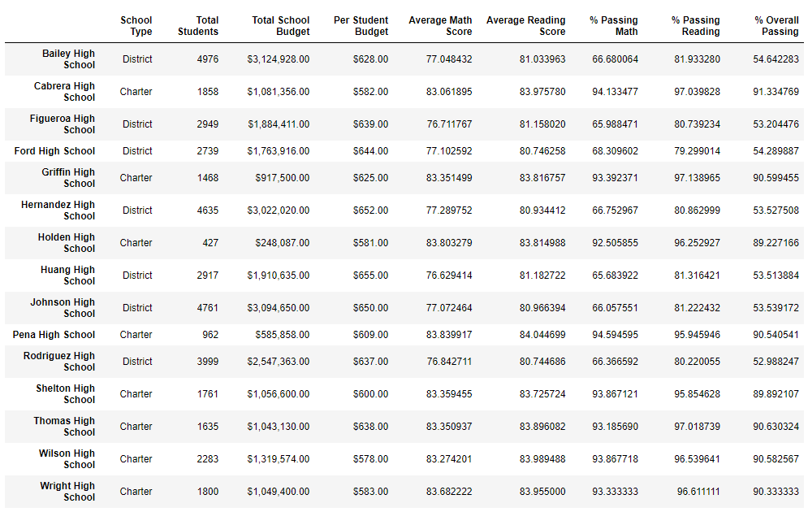
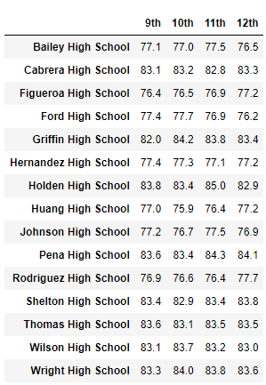
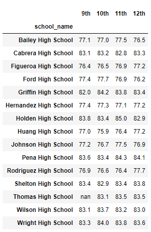
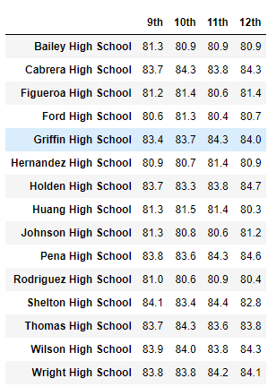
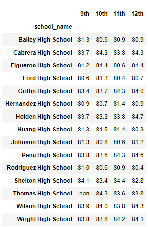

# Challenge 4, Deliverable 3: School District Analysis

## Overview
The purpose of this analysis is to measure the academic performance of students who range from several schools, school district types, budget levels, and grade levels. This is to give a clearer picture of how these factors individually and combined can affect academic performance among students. We are measuring academic performance through their Math and Reading test scores. From the beginning of Module 4, we were tasked with helping our friend Maria, who works for the school board, to conduct this analysis which would help them make decisions based on a number of criteria. The challenge has indicated that Maria and her supervisor were notified that the original test score data file which was provided to us contained scores derived from academic dishonesty, and must be re-evaluated.

## Results
We can measure results as based on a few calculations: Average Math Score, Average Reading Score, % Passing Math,	% Passing Reading, and % Overall Passing. These calculations in the analysis have been grouped together in several different ways for a clearer overall depiction of overall test performance: by school, grade level, school budget (buckets), school size (buckets), and by school type.

#### _District Summary_
The District Summary shows us a summary of the Average Math Score, Average Reading Score, % Passing Math,	% Passing Reading, and % Overall Passing for all 15 schools combined.

As a result of nullifying the Math and Reading test scores for the 9th graders at Thomas High School, the % Passing Math,	% Passing Reading, and % Overall Passing stats have all decreased. Here are images of the District Summary DataFrame (DF) from the Challenge code (9th grade students scores removed) as opposed to the Module code (not removed).

There were 461 students whose test scores were not counted towards these stats - these were all the 9th grade students from Thomas High School. The test scores that would have brought up the averages and percentages were not counted, which accounts for the differences.

#### _School Summary_
The School Summary shows us a summary of the Average Math Score, Average Reading Score, % Passing Math,	% Passing Reading, and % Overall Passing for all 15 schools individually.

The results for this summary are that all of the scores and percentages for Thomas High School have decreased except for the Average Reading score, while the scores for all the other schools stayed the same as a result of not counting the 9th grade Math and Reading test scores from Thomas High School. Below are images from the School Summary DF.

#### _Grade Level Summary_
The Grade Level Summary (Math and Reading) show us a summary of the scores of each school by grade level. The DFs are split between Math and Reading. As the students are all in high school, the grade levels are only 9-12. The only results shown from this summary are that the 9th grade students' scores from Thomas High School are now marked as "NaN" because of the "academic dishonesty" being outlined at the beginning of the challenege.

Math

Reading

#### _School Spending Summary_
The School Spending Summary gives a summary of the scores and percentages of all of the schools after they have been put into bins based on the budget that each student from their school receives. There is no change in scores or percentages as a result from replacing the 9th graders scores.

#### _School Size Summary_
The School Size Summary gives us a summary of the scores and percentages of all of the schools after they have been put into bins based on the size of their school, size being measured by their student population. There is no change in scores or percentages as a result from replacing the 9th graders scores.

#### _School Type Summary_
The School Type Summary gives us a summary of the scores and percentages of all of the schools after they have been grouped into their respective school type categeory. There are only two categories that each school can fall under: District or Charter. There is no change in scores or percentages as a result from replacing the 9th graders scores.

In conclusion, changing the Math and Reading scores of the 9th graders from Thomas High School has had some effects on some of the statistics and calculations as displayed in some of the summaries. For example:

- In the District Summary:
  - Average Math Score decreased
  - % Passing Math decreased
  - % Passing Reading decreased
  - % Overall Passing decreased
- In the School Summary:
  - Average Math Score decreased
  - Average Reading Score increased
  - % Passing Math decreased
  - % Passing Reading decreased
  - % Overall Passing decreased
- All of the other formatted summary DFs stayed the same.

## Summary
Changing the 9th graders' disingenuous scores to NaN caused some changes in a couple of the summary DFs. In both the District Summary DF and the School Summary DF, all stats but the Average Reading score have decreased. Only in the School Summary DF did the Average Reading Score actually increase as a result. All of the other stats in the other summaries stayed the same (in the formatted tables). Because of how the data was grouped together later, the changing of the scores was not enough to make a difference in any of the other statistics.
